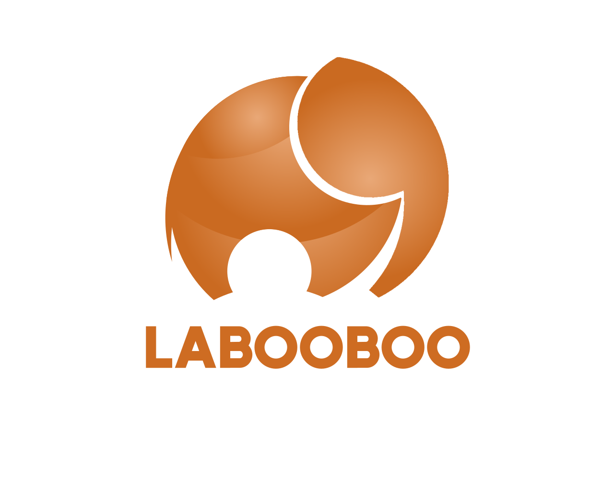

## LABOOBOO BACKEND

## Overview

A backend server to a short-term rental platform. This is an initial solution for creating a direct booking platform. It shall leverage advanced technologies to offer secure, efficient, and AI-enhanced services for user management, property listings, reservations, payments, messaging, and more.

Social Media Link: https://www.instagram.com/labooboo.inc/

src code in private repository

## Features

- **User Management**: Secure registration and login, profile management, mode toggling.
- **Property Listings**: Creation, management, and geolocation of listings with an admin review process.
- **Reservation System**: Workflow for booking, availability calendar, notifications.
- **Reviews and Ratings**: Aggregated reviews for hosts and travellers.
- **Payments**: Secure transactions, history tracking, payouts.
- **Messaging**: Real-time chat with safety features.
- **AI Enhancements**: Sentiment analysis, smart search, automated check-in/check-out.
- **Multilingual Support**: English and French.

